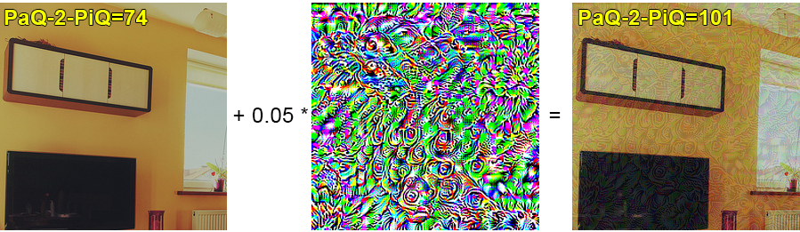
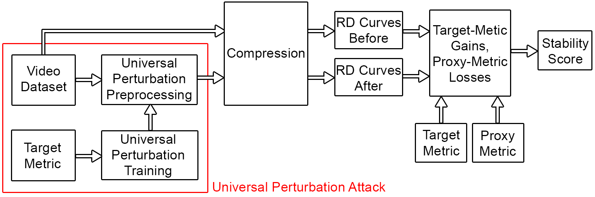
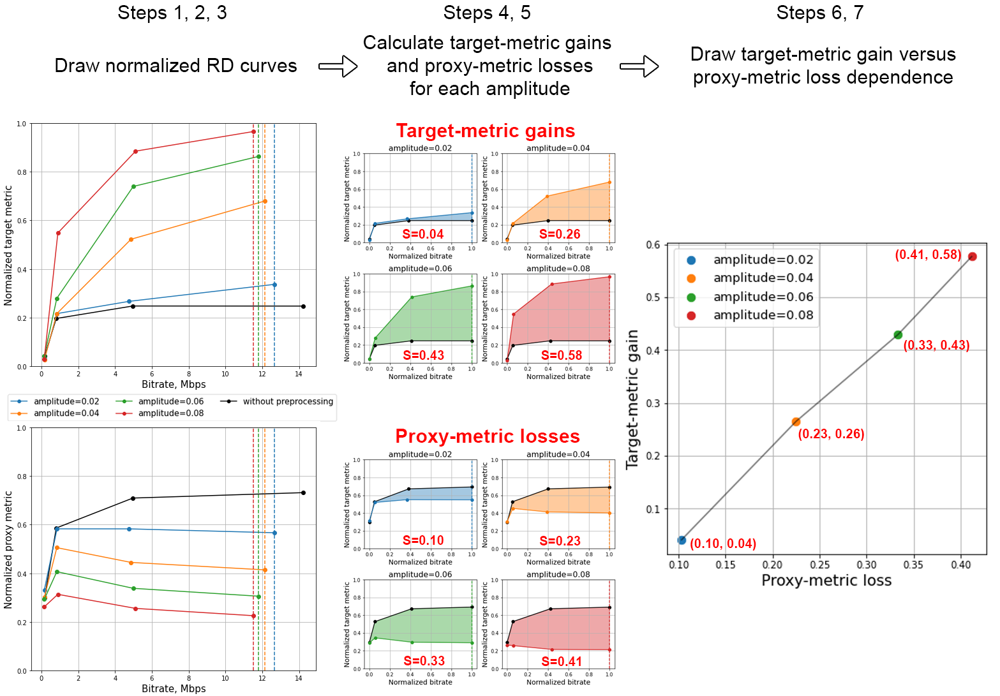
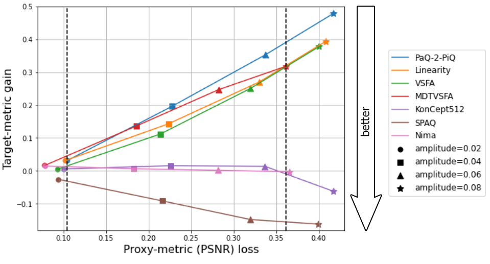

Universal Perturbation Attack
on Differentiable No-Reference
Image- and Video-Quality Metrics (BMVC 2022)
==============

[[BMVC Proceedings](https://bmvc2022.mpi-inf.mpg.de/790/)] [[ArXiv](https://arxiv.org/abs/2211.00366)]

[](https://colab.research.google.com/drive/15NRDymIFkNJS9nM3bBKiE3tlk9MJleXO?usp=sharing)

***We make the first attempt in attacking differentiable no-reference image- and video-quality metrics through UAPs. The goal of attacks on quality metric is to increase the quality score of an output image, when visual quality does not improve after the attack.***


*Example of attack on NR quality metric PaQ-2-PiQ*

## Contributions

* We employed a universal perturbation attack on seven differentiable NR metrics ([PaQ-2-PiQ](https://github.com/baidut/paq2piq), [Linearity](https://github.com/lidq92/LinearityIQA), [VSFA](https://github.com/lidq92/VSFA), [MDTVSFA](https://github.com/lidq92/MDTVSFA), [KonCept512](https://github.com/ZhengyuZhao/koniq-PyTorch), [Nima](https://github.com/truskovskiyk/nima.pytorch/tree/v1) and [SPAQ](https://github.com/h4nwei/SPAQ))
* We applied trained UAPs to FullHD video frames before compression and proposed a method for comparing metrics stability based on RD curves to identify metrics that are the most resistant to UAP attack

## Proposed Method

### Overview


*Scheme of proposed method for assessing target metric stability*

### Experiments setup
* Universal perturbaiton training: the training dataset consist of 10 000 256x256 images from the [COCO](https://cocodataset.org/#home) dataset
* Video dataset: 20 FullHD raw videos from the [Xiph.org](https://media.xiph.org/video/derf/) dataset
* Compression: H.264
codec preset medium at four bitrates (200 kbps, 1 Mbps, 5 Mbps and 12 Mbps)
* Proxy metric: PSNR

### Stability score calculation

Stability score is the area under the target-metric gain versus proxy-metric loss dependence,
with the opposite sign, multiplied by 100. For each metric we calculate the area along
the proxy-metric-axis where dependencies for all tested metrics are determined.


*Calculation of target-metric gain and proxy-metric loss using normalized RD
curves for a video at four amplitude levels. The rightmost chart shows the target-metric
versus proxy-metric loss dependence for these amplitude levels*


## Results


*Target-metric gain versus proxy-metric loss dependencies for all tested NR metrics.
Dotted lines highlight the region where dependencies are defined for all metrics. The less
target-metric gain and the higher PSNR loss are, the more stable is the metric*

| Target Metric | Stability score ↑ | SRCC ↑ [MSU benchmark](https://videoprocessing.ai/benchmarks/video-quality-metrics.html)| SRCC ↑ [BVQA benchmark](https://github.com/vztu/BVQA_Benchmark) |
| - | - | - | - |
| [PaQ-2-PiQ](https://github.com/baidut/paq2piq) | -5.3 | 0.87 | 0.61 |
| [Linearity](https://github.com/lidq92/LinearityIQA) | -4.2 | 0.91 | - |
| [VSFA](https://github.com/lidq92/VSFA) | -3.8 | 0.90 | 0.75 |
| [MDTVSFA](https://github.com/lidq92/MDTVSFA) | -4.8 | <b>0.93</b> | <b>0.78</b> |
| [KonCept512](https://github.com/ZhengyuZhao/koniq-PyTorch) | -0.3 | 0.84 | 0.73 |
| [SPAQ](https://github.com/h4nwei/SPAQ) | 2.6 | 0.85 | - |
| [Nima](https://github.com/truskovskiyk/nima.pytorch/tree/v1) | <b>-0.1</b> | 0.88 | - |

*Stability scores and Spearman correlation coefficient (SRCC) correlations for all tested metrics. Our rating shows which metrics are stable and which are easily increased by attack*


We
recommend the proposed method as an additional verification of metric reliability to
complement traditional subjective tests and benchmarks.

## Citation

If you use this code for your research, please cite our paper.

```
@inproceedings{Shumitskaya_2022_BMVC,
author    = {Ekaterina Shumitskaya and Anastasia Antsiferova and Dmitriy S Vatolin},
title     = {Universal Perturbation Attack on Differentiable No-Reference Image- and Video-Quality Metrics},
booktitle = {33rd British Machine Vision Conference 2022, {BMVC} 2022, London, UK, November 21-24, 2022},
publisher = {{BMVA} Press},
year      = {2022},
url       = {https://bmvc2022.mpi-inf.mpg.de/0790.pdf}
}
```
